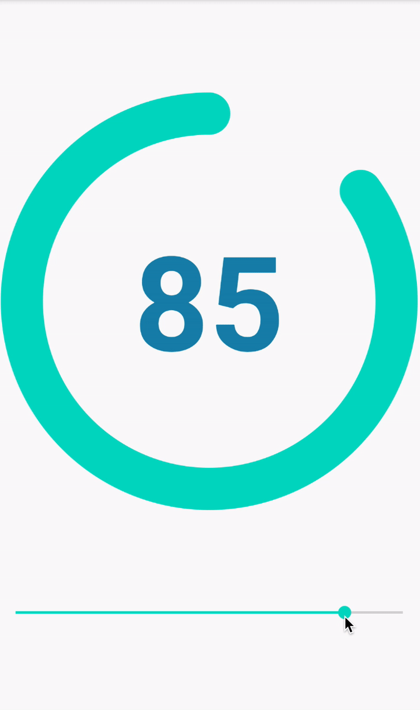

# RatingsView
An android custom view to show ratings

[](https://android-arsenal.com/api?level=16)
[  ](https://bintray.com/kunaalkumar/ratings-view/dev.kunaal:ratings_view/0.0.5/link)
[](https://kunaalkumar.github.io/RatingsView/ratings_view/dev.kunaal.ratings_view/-ratings-view/index.html)



## Dependency
Add this to your module `build.gradle`:
```gradle
dependencies {
    implementation 'implementation 'dev.kunaal:RatingsView:0.0.5'
}
```

## Usage
```xml
<dev.kunaal.ratings_view.RatingsView
        app:textColor="@color/colorAccent"
        app:arcColor="@color/colorAccent"
        app:bgColor="#2d2d2d"
        android:layout_width="wrap_content"
        android:layout_height="wrap_content"/>
```
If `textColor` and/or `arcColor` isn't set, the application's primary color (`R.attr.colorPrimary`) is used.

```kotlin
val ratingsView = findViewById<RatingsView>(R.id.ratings_view)

ratingsView.rating = 84
```
This will animate the number to `84`, as well as the arc itself.

### Multiple Arc Colors
Arc color can be changed depending on the ratings value.
```kotlin
ratingsView.addArcThresholdColor(0, Color.RED)
ratingsView.addArcThresholdColor(50, Color.GREEN)
```
This will change the arc color to red if the rating number is in-between 0-49, and green if the rating number is in-between 50-100

A more convenient way of adding colors is by adding a map.
```kotlin
private val colorsMap = mapOf<Int, Int>(
            0 to Color.RED,
            25 to Color.ORANGE,
            50 to Color.YELLOW,
            75 to Color.GREEN
    )

ratingsView.addArcThresholdColor(colorsMap)
```
The following colors will apply:
- 0  - 24  => Red
- 25 - 49  => Orange
- 50 - 74  => Yellow
- 75 - 100 => Green

To replace a color, just set it again:
```kotlin
// 0 - 100 is Red
ratingsView.addArcThresholdColor(0, Color.RED)
// 0 - 100 is Green now
ratingsView.addArcThresholdColor(0, Color.GREEN)
```
To replace multiple colors, use a map.

All colors can be removed by calling:
```kotlin
ratingsView.removeAllArcThresholdColor()
```
This will set the arc color to the default color, which is the color defined by `app:arcColor` in the XML, or the primary color (`R.attr.colorPrimary`) of the app.
