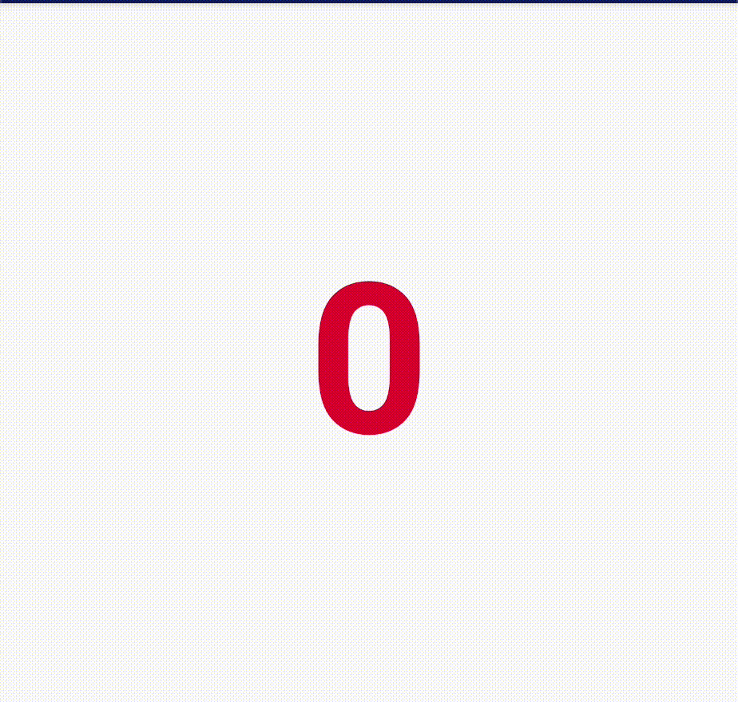
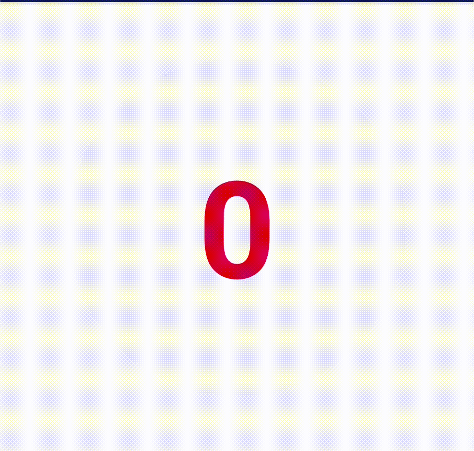

# RatingsView
An android custom view to show ratings

[](https://android-arsenal.com/api?level=16)
[  ](https://bintray.com/kunaalkumar/ratings-view/dev.kunaal:ratings_view/0.0.8/link)
[](https://kunaalkumar.github.io/RatingsView/ratings_view/dev.kunaal.ratings_view/-ratings-view/index.html)


## Dependency
Add this to your module `build.gradle`:
```gradle
dependencies {
    implementation 'dev.kunaal:ratings_view:0.0.8'
}
```
# Table of Contents
- [RatingsView](#ratingsview)
  - [Dependency](#dependency)
- [Table of Contents](#table-of-contents)
- [Usage](#usage)
  - [Basic](#basic)
  - [Rating Number](#rating-number)
  - [Rating Text Color](#rating-text-color)
  - [Rating Arc Color](#rating-arc-color)
  - [Rating Arc Width Scale](#rating-arc-width-scale)
  - [Background Color](#background-color)
  - [Multiple Arc (Threshold) Colors](#multiple-arc-threshold-colors)
  - [Loading Animation](#loading-animation)

# Usage
## Basic


```xml
<dev.kunaal.ratings_view.RatingsView
        app:textColor="@color/colorAccent"
        app:arcColor="@color/colorAccent"
        android:layout_width="wrap_content"
        android:layout_height="wrap_content"/>
```
```kotlin
val ratingsView = findViewById<RatingsView>(R.id.ratings_view)

ratingsView.rating = 84
```
This will animate the number to `84`, as well as the arc itself.

## Rating Number


The rating text size can be changed by:
```kotlin
ratingsView.textScale = 1.5F
```
Or via XML by:
```xml
app:textScale="1.5"
```
This will increase the text size by 50% of it's normal size.
By default this value is set to `1F`

## Rating Text Color


The text color can be changed by:
```kotlin
ratingsView.setTextColor(Color.GREEN)
```
Or via XML by:
```xml
app:textColor="@color/green"
```
By default this value is set to `R.attr.colorAccent`

## Rating Arc Color


The arc color can be changed by:
```kotlin
ratingsView.setArcColor(Color.GREEN)
```
Or via XML by: 
```xml
app:arcColor="@color/green"
```
By default this value is set to `R.attr.colorPrimary`

## Rating Arc Width Scale


The arc width can be changed by:
```kotlin
ratingsView.setArcWidthScale(1.5F)
```
Or via XML by:
```xml
app:arcWidthScale="1.5"
```

This will increase the text size by 50% of it's normal size.
By default this value is set to `1F`

## Background Color


The background color can be changed by:
```kotlin
ratingsView.setBgColor(Color.ORANGE)
```
Or via XML by:
```xml
app:bgColor="@color/orange"
```

To remove the background color, set the background color to `android.R.color.transparent`

By default there is no background color.

## Multiple Arc (Threshold) Colors 
<p align="center">
    
</p>

Arc color can be changed depending on the ratings value.
```kotlin
ratingsView.addArcThresholdColor(0, Color.RED)
ratingsView.addArcThresholdColor(50, Color.GREEN)
```
This will change the arc color to red if the rating number is in-between 0-49, and green if the rating number is in-between 50-100

A more convenient way of adding colors is by adding a map.
```kotlin
private val colorsMap = mapOf<Int, Int>(
            0 to Color.RED,
            25 to Color.ORANGE,
            50 to Color.YELLOW,
            75 to Color.GREEN
    )

ratingsView.addArcThresholdColor(colorsMap)
```
The following colors will apply:
- 0  - 24  => Red
- 25 - 49  => Orange
- 50 - 74  => Yellow
- 75 - 100 => Green

To replace a color, just set it again:
```kotlin
// 0 - 100 is Red
ratingsView.addArcThresholdColor(0, Color.RED)
// 0 - 100 is Green now
ratingsView.addArcThresholdColor(0, Color.GREEN)
```
To replace multiple colors, use a map.

All colors can be removed by calling:
```kotlin
ratingsView.removeAllArcThresholdColor()
```
This will set the arc color to the default color, which is the color defined by `app:arcColor` in the XML, or the primary color (`R.attr.colorPrimary`) of the app.


## Loading Animation
<p align="center">
    
</p>

A loading animation can be started by `ratingsView.startLoadingAnimation()` and stopped by `ratingsView.stopLoadingAnimation()`

More conveniently, as the view is self-aware of it's loading state, `ratingsView.toggleLoadingAnimation()` can be called to automatically toggle between start and stop loading states


While in loading state, the outer arc uses the `arcColor` and the inner arc uses the `textColor`. 